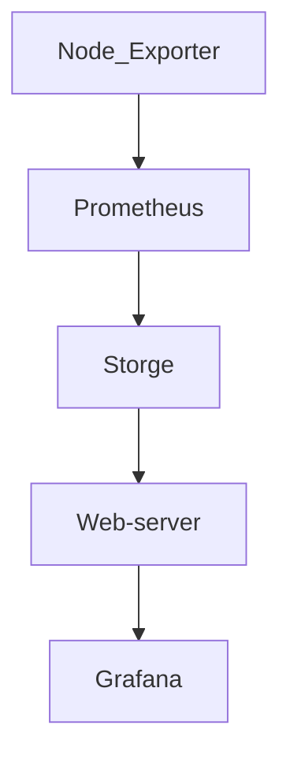

# time-series 
Предназначен для прогнозирования временных рядов на основе полученных данных за определенный период

## Функциональность

### Описание

```mermaid
graph TD;
    Node_Exporter-->Prometheus;
    Prometheus-->Storge;
    Storge-->Web-server;
    Web-server-->Grafana;
```

##### Библиотеки