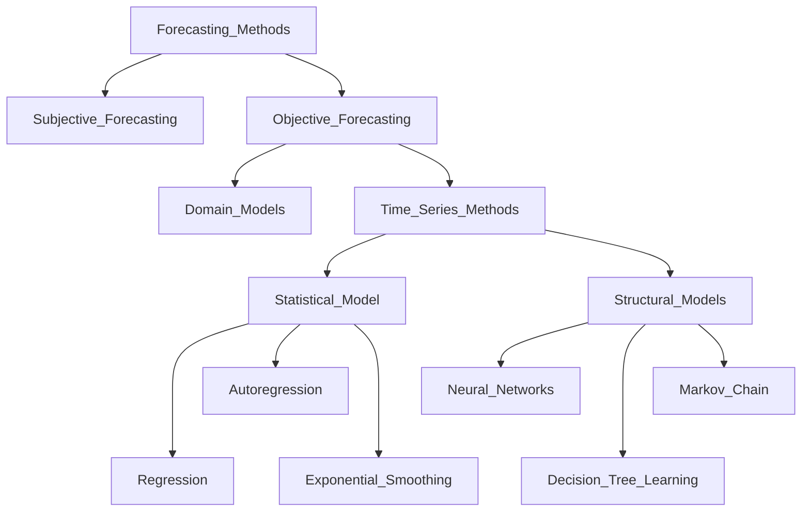
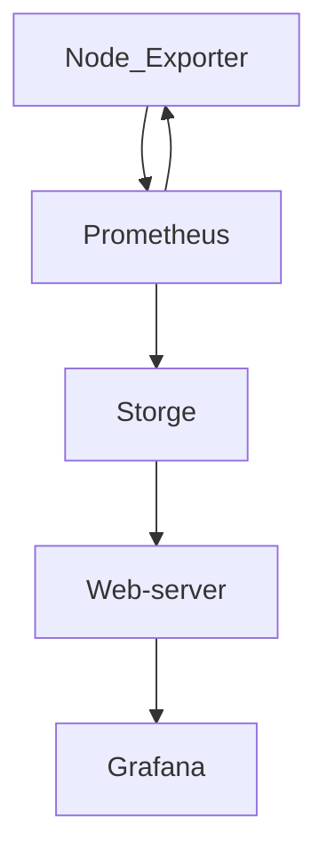

<h1 align="center"> Time Series </h1>
<h3 align="center"> Designed for forecasting time series based on period data </h3>

<h2 align="center"> Description </h2>

<h4 align="center"> General classification of forecasting methods </h4>

<h4 align="center"> Since we are forecasting time series, we choose statistical models such as Holt's linear trend, Holt-Winter method and SARIMA </h4>

<h4 align="left">SARIMA</h4>
<ul>
  <li>S-Seasonal</li>
  <li>AR-Auto Regression</li>
  <li>I-Integration</li>
  <li>MA-Moving Average</li>
</ul>

<h2 align="center"> Functionality </h2>

<h3 align="left"> Libraries </h3>

NumPy to do math
https://numpy.org/

Pandas for working with data
https://pandas.pydata.org/docs/index.html

Matplotlib to plot the graph
https://matplotlib.org/

statsmodels for Holt-Winter and SARIMA calculations
https://www.statsmodels.org/stable/index.html

sklearn and math to calculate the mean square error
https://scikit-learn.org/stable/ and https://docs.python.org/3/library/math.html
